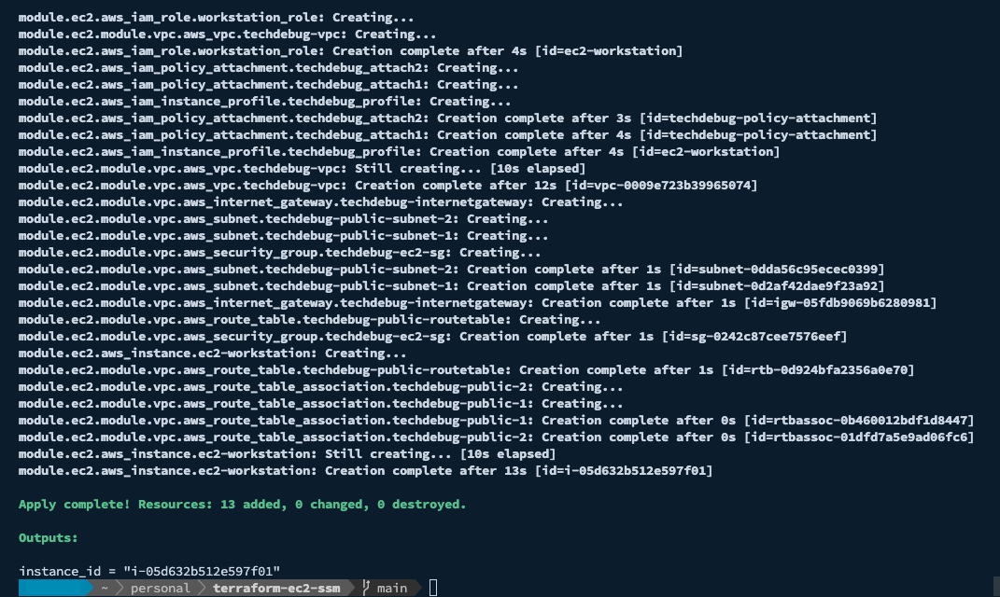

# terraform-ec2-ssm

Sets up an EC2 workstation with CentOS 7 (x86_64) in `ap-southeast-2`
## Setup

### Remote State

Ensure using [S3 remote state](https://github.com/lantrix/terraform-remote-state-s3)

```shell
export accountId=$(aws sts get-caller-identity --query Account --output text)
terraform init \
    -backend-config="region=ap-southeast-2" \
    -backend-config="workspace_key_prefix=ec2-soapbox" \
    -backend-config="bucket=terraform-state-${accountId}" \
    -backend-config="key=soapbox-terraform.tfstate" \
    -backend-config="dynamodb_table=terraform-state"
```

### Local State

If you don't want to sync your state remotely just:

```shell
terraform init
```

### Deploy

```shell
terraform plan
terraform apply
```

It will run and spit out the EC2 instance ID



## Connect to EC2 with SSM Session Manager

Install [Session Manager plugin](https://docs.aws.amazon.com/systems-manager/latest/userguide/session-manager-working-with-install-plugin.html) for AWS CLI first.

Start the session using the output `instance_id`

```
aws ssm start-session \
    --document-name soapbox-demo \
    --target i-053cc3cc379ef0069
```
